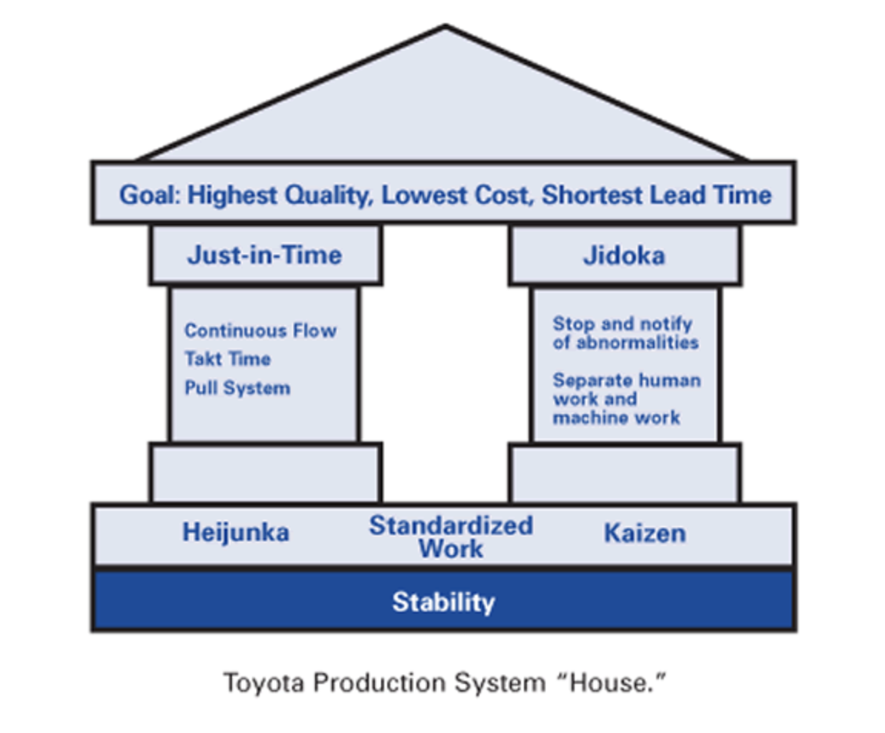
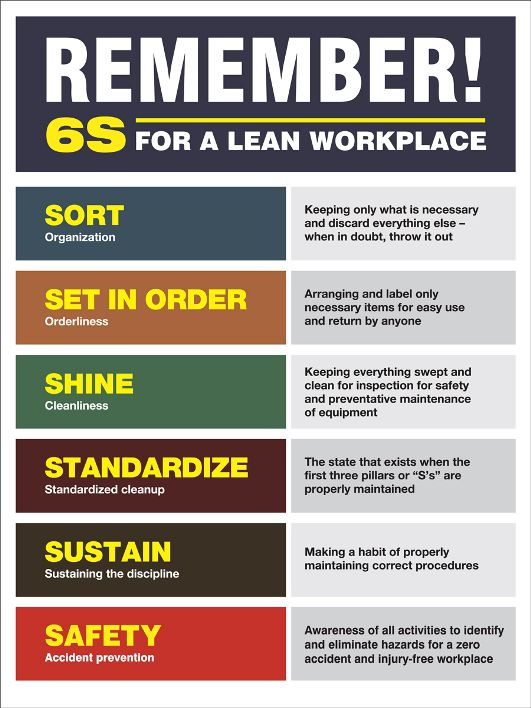
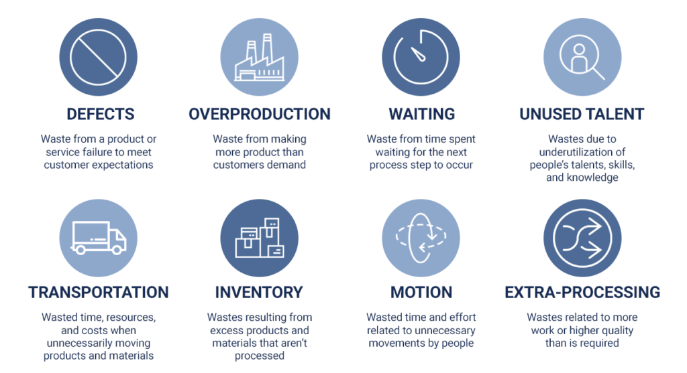

# Kanban

## Results {.tabset}
### Etimología y Origen

La etimología (del japonés) tarjeta o señal y (del chino) señal o tablero. Está diseñado por David J. Anderson para la gestión del flujo de trabajo, basado en los sistemas **Lean Manunfacturing** a los que dio pie el trabajo de Toyota.

- Basado en sistema *Just in Time* que representa un sistema de arrastre. Es decir, la producción se basa en la demanda de los clientes

- Se evita la *Práctica push* de fabricar productos e intentar venderlos.

### Japanese TPS System

También conocido como **Toyota Production System (TPS) es un método** para gestionar el trabajo que surgió a finales de los 40. Visualmente la podemos esquematizar como una casa compuesta de o la *Toyota Production System House* que se compone de la meta, los pilares, las bases y los cimientos:

{#id .class width=600 height=500px}

**- Meta:** La mejor calidad, el menor costo y corto tiempo de entrega. 

**- Pilares:**

- Just-In-Time (Justo a tiempo): Producir sólo lo necesario, en el momento justo, en la cantidad necesaria, con lo mínimo necesario.

  - Continuous flow 1x1
  
  - Takt Time
  
  - Pull System
  
- Built-in Quality (Construir con calidad): Comenzar desde el inicio a construir con calidad, prevenir que si se presentan defectos pasen al siguiente proceso, asegurando así la calidad durante el proceso de producción

  - Stop & Notify of abnormalities
  
  - Separate Man, Machine Work

**- Bases: **
- Standarized Work

  - Level production
  
  - Kaizen: Significa "cambio para mejorar"; deriva de las palabras KAI-cambio y ZEN-bueno. Kaizen es el cambio en la actitud de las personas. Es la actitud hacia la mejora, hacia la utilización de las capacidades de todo el personal, la que hace avanzar el sistema hasta llevarlo al éxito. 

**- Cimientos:**

- VSM (Value-Stream mapping). Es parte del Lean-Management Method para analizar el estado actual y diseñar un estado futuro para los eventos que llevan a un producto al cliente final. Es una herramienta visual que muestra todos los pasos críticos en un proceso específico y cuantifica facilmente el tiempo y volumen tomado en cada etapa.

- ID Waste: Proviene del Lean Six Sigma (8 wastes). Identificar los tipos de desperdicio, sobreproducción, tiempos de espera, transporte, sobreprocesamiento, inventarios innecesarios, movimientos innecesarios, defectos y talento humano. 

- Visual Mgmt: Visual Management, para tener el conocimiento, el objetivo de la empresa. Conocer desde arriba hasta abajo.

- 5S & Safety. Los primeros 5 pilares provienen de Lean Workplace, y el sexto se añade:

  - **Sort:** Organización. Mantener solo lo que es necesario y descartar todo lo demás. Si en duda, descartarlo.
  
  - **Set in Order:** Orden, arreglando y etiquetando solo los productos necesarios para su facil uso y encontrarlos facilmente. 
  
  - **Shine:** Limpieza. Mantenar todo limpio para inspección. Para seguridad y mantenimiento preventivo.
  
  - **Standarize:** Limpieza estandarizada. El estado que existe cuando los primeros tres pilares "S" son propiamente mantenidas. 
  
  - **Sustain:** Sostener la disciplina. Hacer el hábito de mantener propiamente los procedimientos. 
  
  - **Safety:**

{#id .class width=400 height=500px}

### Las 3 M's

También se les conocen como las 3M de Toyota. Los conceptos no pueden ser vistos por separado, ya que en conjunto, presentan las barreras para el valor. El oibjetivo debe ser identificar y eliminar las 3M en las disitintas etapas del proceso a mejorar. El Muda es comunmente el que se enfoca a eliminar por que es más fácil de encontrar, pero el Mura y Muri son muchas veces causas raíz del Muda, producto de irregularidades y tensiones existentes. 

{#id .class width=600 height=350px}

#### MUDA

**- MUDA:** Evitar procesos que consumen recursos y no agregan valor extra al producto/cliente. Las 8 categorías para reducir el Muda se relacionan son (8 wastes): 

- **Defects:** Esfuerzo extra causado por falta de definión, información incorrecta, esfuerzos causados por retrabajo, chatarra, información incorrecta.

- **Overproduction:** Produccion que es más quer necesaria o antes que sea necesitada

- **Waiting:** Tiempo desperdiciado para los sigueintes pasos en un proceso

- **Non-Utilized Talent:** Talento, skills o conocimiento subutilizado

- **Transportation:** Traslados no necesarios de productos y materiales

- **Inventory:** Exceso en productos y materiales que no se procesaron

- **Motion:** Movimientos no necesario de personas

- **Extra-processing:** Más trabajo o más calidad de la requerida por el cliente

{#id .class width=500 height=270px}

#### MURA

**- MURA:** Eliminar el desperdicio generado por las irregularidades en el sistema 

#### MURI

**- MURI:** Eliminar el desperdicio generado por las complejidades del trabajo (sobrecarga en el equipo y las personas) que da lugar a actividades sin valor añadido (cuellos de botella, sobrestock, reprocesos, ciclos más lentos, etc.)

### Kanban

Es un método para definir, gestionar y mejorar servicios que entregan valor, tales como servicios profesionales, trabajos o actividades qne las que interviene la creatividad y el diseño tanto de productos de software como físicos. 

Se caracteriza por el principio de "empieza por donde estés", por medio del cual se consigue catalizar el cambio rápido y focalizado, reduce la resistencia y ayuda a trabajar en línea con los objetivos de la organización.

El método Kanban se basa en hacer visible lo que es trabajo intangible, para asegurar que el trabajo es requerido y necesitado por el cliente, el equipo tiene la capacidad de entregar.

#### 9 Valores Kanban:

**- Transparencia:** Un intercambio abierto de información y un vocabulario claro y no ambiguo que permita crear transparencia en otras las areas. 

**- Equilibrio:** Se es eficiente para balancear los diferentes requerimientos, vistas y habilidades de todos los participantes entre ellos.

**- Colaboración:** El método Kanban mejora la manera en que las personas trabajan juntas. Colaboración es uno de los puntos principales. 

**- Foco en el cliente:** Los clientes y el valor que se les brinda son el centro de interés de todas las personas involucradas en la compañía.

**- Flujo:** El trabajo representa a un flujo continuo u ocasional de cadena de valor. Un punto de inicio para usarlo en Kanban es reconocer y mantener ese flujo.

**- Liderazgo:** El liderazgo es requerido a todos los niveles para generar valor y mejorar el estado actual. 

**- Entendimiento:** Implica el self-awareness individual y de la organización para movernos hacia adelante. Kanban es un método de mejora que requiere cambio, que requiere entendimiento. Una vez que se identificó un problema, se determina causa y efecto. Esto significa que se necesita ententer el trabajo y el proceso involucrado para poder mejorarlo. Empieza con lo que haces y entiende como lo estas haciendo. 

**- Acuerdo:** En un acuerdo todas las partidos acuerdan perseguir las mismas metas juntos. Diferentes opiniones y visiones deben ser respetadas. Todas estos diferentes puntos de vista deben converger eventualmente. Este parte de el compromiso de las personas involucradas en el proceso para en conjunto mejorar el cumplimiento de los objetivos. 

**- Respeto:** Respeto por las personas en la forma de aprecio del trabajom, entendimiento y consideración es funcamental. Empezar con lo que haces y despues mirar si se cumple o no cumple en objetivo o necesidades dentro de la organización.

#### 3 Principios directores Kanban:

**- Sostenibilidad (Hacia adentro): **

**- Orientación al servicio (Hacia afuera): **

**- Supervivencia (Hacia el futuro): **

#### 6 Principios fundacionales Kanban:

Se pueden dividir en *tres principios de gestión del cambio (GC)* y *tres principios de prestación de servicios (PS)*:

- (GC) Comienza con lo que haces ahora entendiento los procesos actuales, respetando roles existentes
- (GC) Acuerda buscar la mejora a través del cambio evolutivo
- (GC) Fomenta actos de liderazgo a todos los niveles, desde contribuyentes a directivos
- (PS) Comprendere y concentrarse en necesidades y expectativas de clientes
- (PS) Administra el trabajo, que la gente se auto-organice
- (PS) Organización es un ecosistema de servicios independientes, guiados por políticas

#### Prácticas Kanban:

#### Herramientas Kanban:

