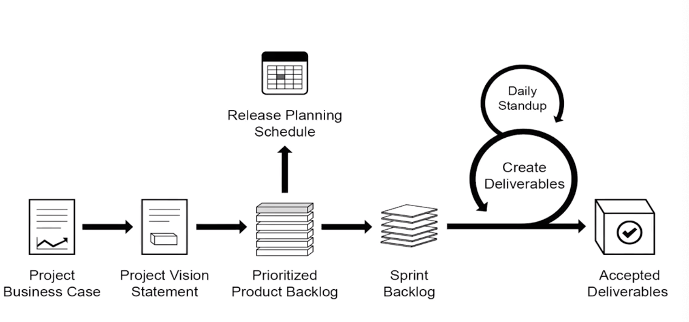
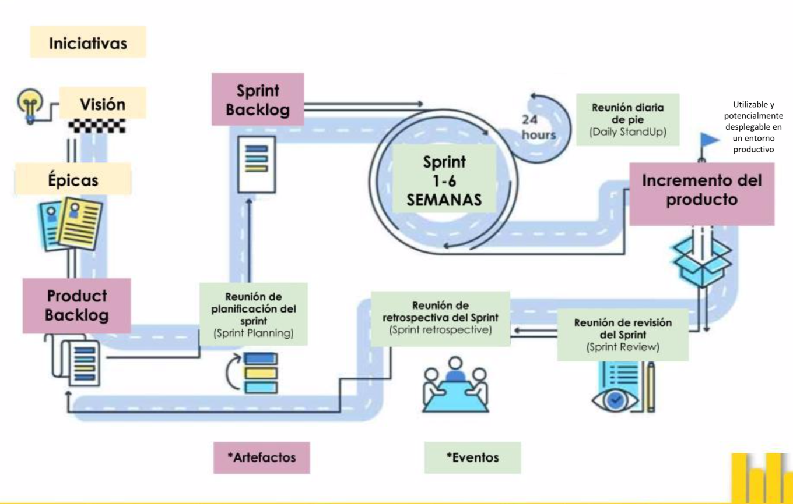
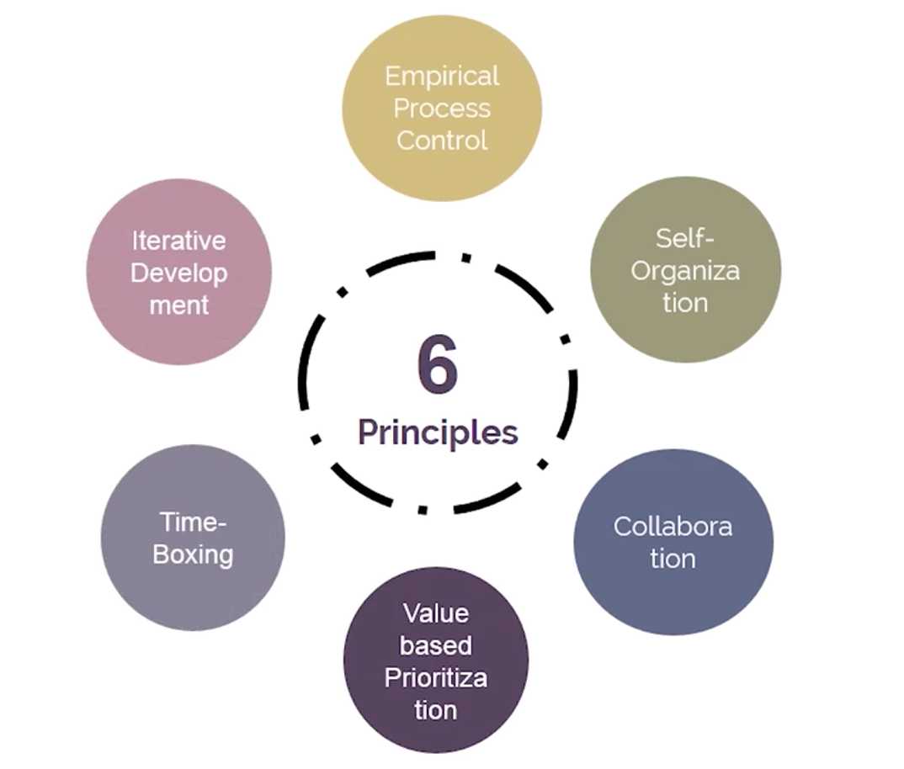
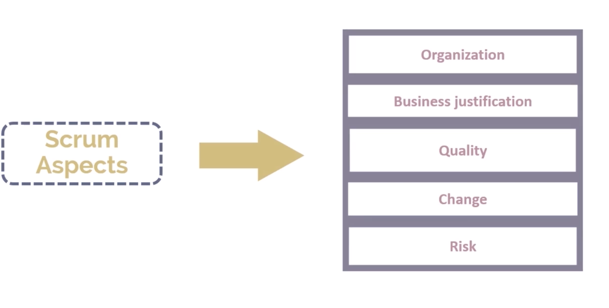

# Fundamentos scrum

## Introducción y SBOK

### Introducción
Se busca un esfuerzo colaborativo para crear un producto que se ve afectado por limitación de tiempo, costos, alcance, calidad, recursos, capacidades organizaciones, etc. que dificultan su planificación, ejecución, administración y éxito. 

Para estos proyectos es importante que se ocupe un método de gestión de proyectos. Scrum es una metodología popular de Agile que se caracteriza por ser adaptativo, iterativo, flexible y eficaz, además promueve la transparencia en la comunicación y crea una responsabilidad colectiva mediante la organización de **equipos interfuncionales, autoorganizados y empoderados** que trabajan juntos en estrecha colaboración en ciclos cortos llamados sprints (1 a 6 semanas).

{#id .class width=500 height=250px}

### Historia de SCRUM
El framework tuvo su nacimiento en 1980's. Takeuchi y Nonaka propusieron que el desarrollo de un producto debería ser un proceso donde se trabaje como una unidad que logre un fin común. Ken Schwaber y Jeff Sutherland elaboraron el concepto Scrum y su aplicabiliodad a Desarrollo de Software en 1995 en Austin, Texas, en la conferencia OOPSLA. 

## Beneficios de SCRUM

1. Adaptibilidad: El control de procesos empíricos y entregas iterativas hacen proyectos adaptables. 

2. Centrado al Cliente: El proceso incluye stakeholders

3. Entrega de valor continuo.

4. Entrega pronta de Alto valor. Centralizar en un backlog de producto priorizado permite dar alto valor

5. Feedback continuo: Proveido por el daily standup

6. Transparencia: el *Scrumboard* y el *Sprint Burndown Chart* son compartidos, que llevan a un ambiente de trabajo abierto

7. Mejora continua: los entregables con mejorados continuamente sprint por sprint a través del priorizado backlog. 

8. Paso sostenible: las personas involucradas determinan un paso sostenible que puedan en teoría continuar indefinidamente

9. Proceso eficiente de desarrollo. Time boxintg

10. Motivation: Daily standup y 

11. Resolución de problemas rapida: colaboraciópon y colocac

12. Entregas efectivas

13. Responsabilidad colectiva

14. Alta velocidad: habilida equipos cross-functional que potencia y 

15. Ambiente inovador:

## Marco de trabajo

Los principios, aspectos y procesos de Scrum interactúan entre sí y son de igual importancia al tratar de obtener una mejor compresnción del marco de trabajo. 

### Flujo Scrum 

{#id .class width=500 height=350px}

### Principios de Scrum (6)

Los principios scrum son las guias base para aplicar el marco de trabajo Scrum y que deben ser usadas en todos los proyectos Scrum: 

{#id .class width=500 height=500px}

**1. Control del proceso empírico:** Se basa en la teoría de control de procesos empírica. Asegura que el conocimiento procede de la experiencia y de tomar decisiones basándose en lo que se conoce. Tres pilares soportan toda la implementación del control empírico: *Transparencia*, *inspección* y *adaptación*.

**2. Auto-organización:** Scrum sostiene que las personas cuentan con motivación propia y que ofrecen más valor cuando se autoorganizan.

**3. Colaboración:** Se centra en las tres dimensiones básicas relacionadas con el trabajo colaborativo: Awareness, articulación, aprobación.

**4. Priorización basada en el valor:** Pone el enfoque de Scrum para ofrecer el máximo valor de negocio, desde el principio del proyecto hasta su conclusión.

**5. Time boxing:** El tiempo se considera una restricción limitante y cómo este se utiliza para ayudar a manejar eficazmente la planificación y ejecución del proyecto. 

**6. Desarrollo iterativo:** Este principio define el desarrollo iterativo y hace énfasis en cómo gestionar mejor los cambios y crear productos que satisfagan las necesidades del cliente. 

### Aspectos de Scrum (5)

{#id .class width=500 height=500px}
<\center>

**1. Organización:**
Entender los roles definidos y responsabilidades en el proyecto.

- Roles centrales: encargados de producir el producto o servicio. Son individuos que estan 
  - Equipo de desarrollo: Son los miembros del equipo Scrum responsables de atender los requisitos especificados por el PO y de crear los entregables del proyecto.
  - Product Owner: Es la persona responsable de lograr el máximo valor empresarial para el proyecto. Es la voz del cliente.
  - Scrum Master: Es un facilitador que asegura que el equipo Scrum cuente con un ambiente propicio para completar el proyecto con éxito.
- Roles no centrales:
  - Stakeholders
  - Vendedores
  - Scrum Guidance Body
  - Clientes y usuarios
**2. Justificación del negocio:** Se basa en el concepto de entrega impulsada por el valor. Scrum busca iniciar la entrega de resultados lo antes posible.

**3. Calidad:** La capacidad con la que cuenta el producto o los entregables para cumplir con los criterios de aceptación y de alcanzar el valor de negocio que el cliente espera. 

**4. Cambios:** Los procesos de desarrollo de Scrum están diseñados para aceptar el cambio

**5. Riesgo:** Un evento incierto o serie de eventos que pueden afectar los objetivos de un proyecto y pueden contribuir a su éxito o fracaso. Impacto positivo: oportunidades, Impacto negativo: amenazas.

La gestión de riesgos debe hacerse de forma preventiva:
- La probabilidad de ocurrencia de cada riesgo
- Posible impacto en el caso de tal ocurrencia

### Procesos de Scrum (19)

#### 5 fases
Fase: Iniciación
  - Crear la visión del proyecto
  - Identificar al Scrum Master e interesados en el proyecto
  - Formación del equipo Scrum (de 3 a 9 personas)
  - Desarrollo de épicas
    - Mayor a 3 meses: Iniciativas
    - Menor o igual a 3 meses: Épicas
    - Menor a 2 semanas: Historias de usuario
    - Menor a 8 horas (en promedio 4): Tareas
  - Crear el backlog priorizado del producto
    - Debe tener: Historias de usuario
    - No debe tener: Épicas
  - Realizar el plan del lanzamiento

Fase: Planificación y estimación
  - Elaborar historias de usuarios:
    - Como [rol de usuario] quiero [objetivo] para poder [beneficio]
  - Estimar historias de usuarios
  - Compremeter historia de usuarios
  - Identificar tareas
  - Estimar tareas
  - Crear el sprint backlog
    - Product backlog > Spring backlog

Fase: Implementación
  - Crear entregables
  - Realizar Daily Meeting
  - Refinar el backlog priorizado del producto

Fase: Revisión y retrospectiva
  - Demostrar y validar el sprint
  - Retrospectiva del sprint

Fase: Lanzamiento
  - Envío de entregables
  - Retrospectiva del proyecto

