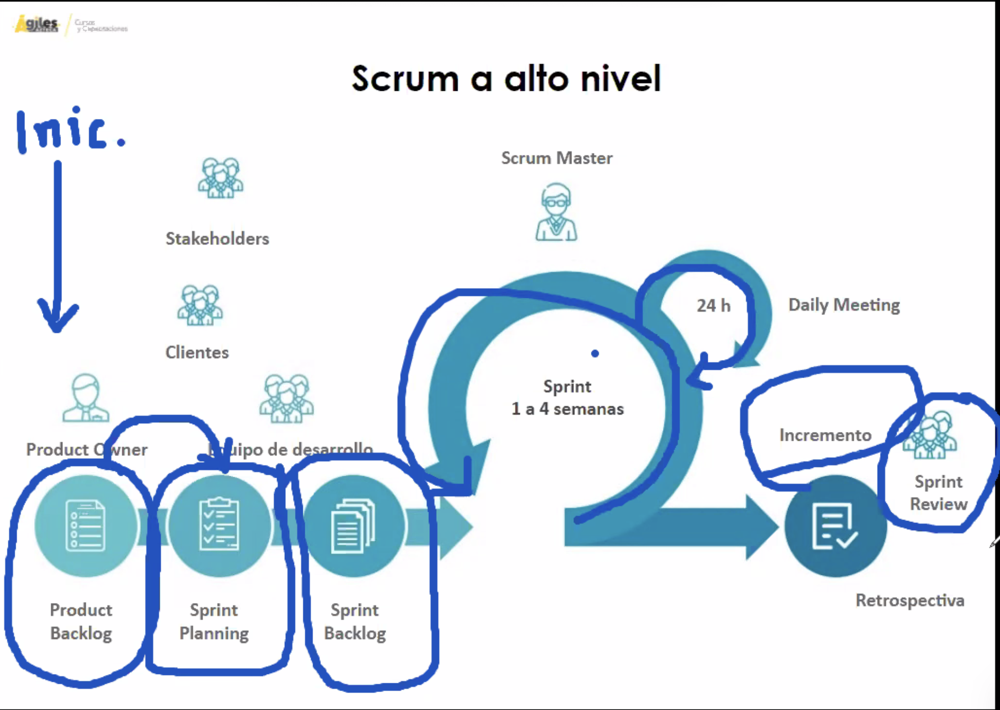
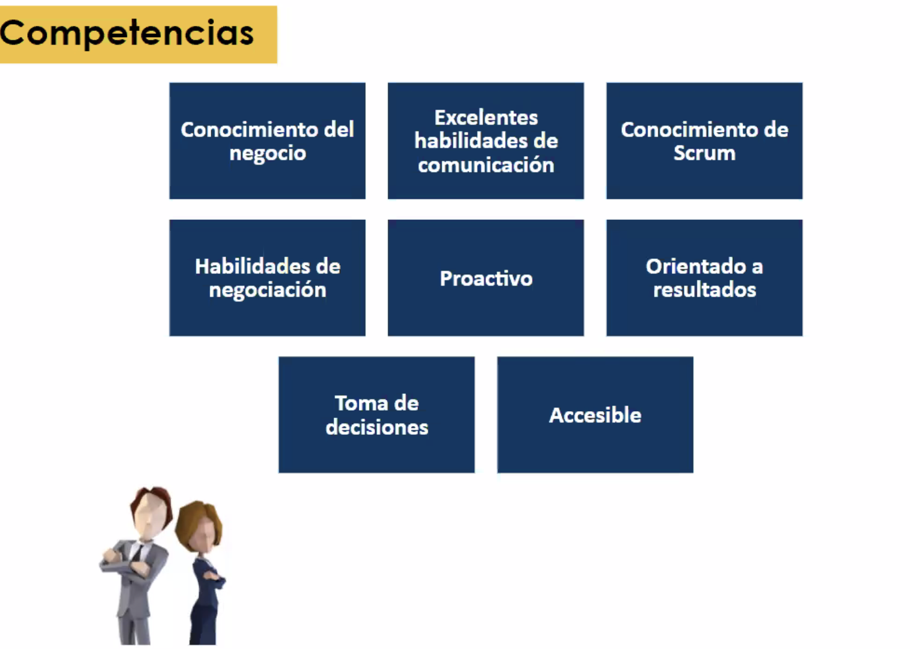
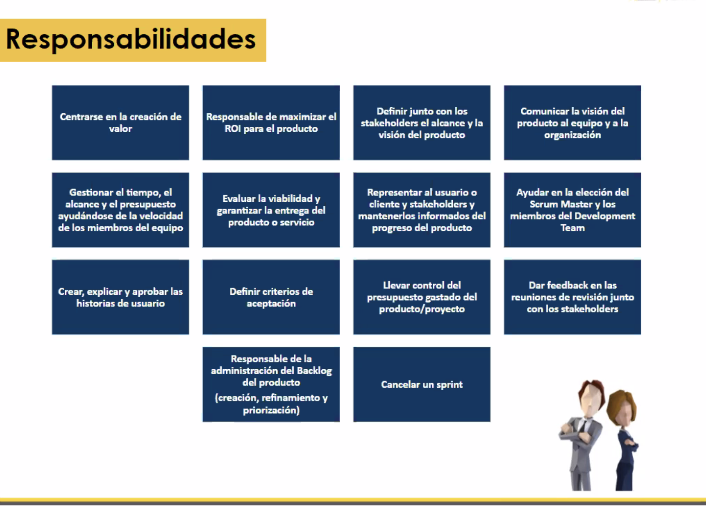
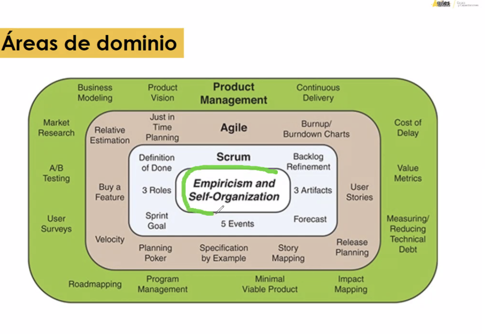
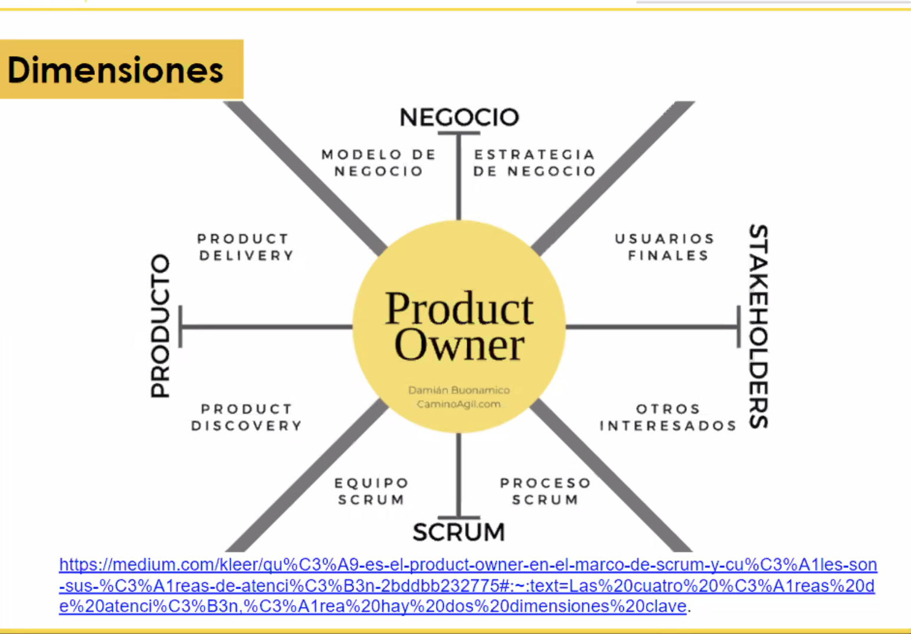

# Product Owner

## Scrum a alto nivel

{#id .class width=600 height=380px}

### 3 Roles
1. **Product Owner**: 
2. **Equipo de Desarrollo**
3. **Scrum Master**

#### Competencias del Product Owner
- Conocimiento del negocio
- Excelentes habilidades de comunicación
- Habilidades de negociacion
- Proactivo
- Toma de decisiones
- Accesible
- Orientado a resultados
- Conocimiento de Scrum

{#id .class width=600 height=400px}

#### Responsabilidades de Product Owner

1. Centrarse en la creación de valor
2. Responsable de maximizar el ROI para el producto
3. Definir junto con los stakeholders el alcance y la visión del producto
4. Comunicar la visión del producto al equipo y a la organización
5. Gestionar el tiempo, el alcance y el presupuesto ayudándose de la velocidad de los miembros del equipo
6. Evaluar la viabilidad y garantizar la entrega del producto o servicio
7. Representar al usuario o cliente y stakeholders y mantenerlos informados del progreso del prodcuto
8. Ayudar en la elección del Scrum Master y los miembros del Development Team
9. Crear, explicar y aprobar las historias de usuario
10. Definir criterios de aceptación
11. Llevar control del presupuesto gastado del producto/proyecto
12. Dar feedback a las reuniones de revisión junto con los stakeholder
13. Responsable de la administración del Backlog del producto (creación, refinamiento y priorización)
14. Cancelar un sprint

{#id .class width=600 height=400px}

#### Areas de Dominio del PO

Primer Círculo:
- Empirismo y autoorganizado

Segundo Círculo:
- Marco de trabajo de Scrum
  - Definición de 
  - Meta de Sprint: Cada dos semanas tenemos una meta específica, alineada con la visión del producto que transmitimos al equipo

Tercer Círculo:
- Agile

Cuarto Círculo:
- Product Management

{#id .class width=600 height=400px}

#### PO Crack
1) **C**olaborativo
2) **R**epresentativo
3) **A**utorizado
4) **C**omprometido
5) **K**nowledge (Adquiere conocimiento de tu área permanentemente)

#### Componentes

{#id .class width=600 height=400px}

### 5-Eventos
1. **Sprint** es en contenedor de los demás eventos (Sprint de dos semanas)
2. **Sprint Planning**
3. **Sprint Review** 
4. **Sprint Retrospective**
5. **Daily meeting**

### 3-Artefactos
1. **Product Backlog:** Responsable de Product Owner
2. **Spring Backlog:** Responsable de Equipo de desarrollo
3. **Incremento:** Algo potencialmente liberable

