# Product Owner (Norma Hernández)

## Safe 5.0

Scaled Agile Framework es una base de conocimientos, probados e integrados para lograr la agilidad del negocio mediante prácticas y competencias Agiles y Devops. Safe y Scrum funcionan para los valores y principios agiles.

Scrum: es un framework que esta basado en los valores y principios ágiles
Safe: es un framework que implementa Scrum a un nivel empresarial

Diferencias entre Scrum / Safe
```{r}
library(knitr)
kable(
  data.frame(
Diferencia = c(1,2,3,4,5),
Scrum = c("Se encarga de acuerdos entre equipos pequeños y cross funcionales", "Es adoptado por los equipos agiles", "La gerencia media no juega rol", "La estructura básica es el equipo Scrum", "Scrum omite varios aspectos esenciales"),
Safe = c("Se encarga de equipos grandes y multigeográficos", "Adoptados por empresas completas, no solo por el equipo Scrum", "Program y Portfolio management son dos figuras importantes de Safe", "La estructura básica es el ART (Agile Release Train)", "Con Safe todas las caracteristicas y aspectos de una organización pueden ser gestionados")
)
)
```

<center>
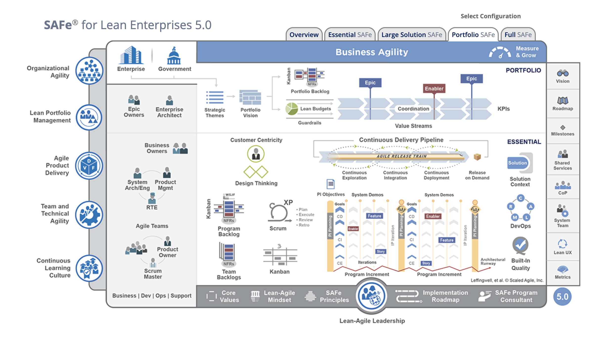{#id .class width=600 height=380px}
</center>


## Flujo agil en GS

### Planificación Trimestral (PI)
Es un evento al que asisten todos los interesados, colaboradores y equipos que participarán en la toma de decisiones y construcción de productos y servicios.

Los equipos planifican los objetivos definidos y priorizados por la capa directiva que se trabajarán en el próximo trimestre. El PI permite una alineación y compromiso de los equipos participantes. *Permite una alineación y compromiso de los equipos participantes*.

### Beneficios:

1. Establecer la comunicación cara a cara entre todos los miembros del equipo y las partes interesadas. Se puede ligar con un principio Agil: La mejor manera de establecer comunicación entre los equipos es por medio de la comunicación cara a cara.
2. Construir la conversación de la que depende el portafolio
3. Alinear el desarrollo a los objetivos comerciales con el contexto empresarial, la visión y los objetivos del PI del equipo y del programa
4. Identificar dependencias y fomentar la colaboración entre los equipos y otros equipos de otras áreas
5. Brindar la oportunidad de "la cantidad justa" de arquitectura y orientación de experiencia de usuario
6. Adecuación de la demanda a la capacidad, eliminando el exceso de trabajo en proceso (WIP)
7. Toma de decisiones rápida
8. Validar la viabilidad con todas las áreas involucradas

### Cultura empresarial

Colaboración, Transparencia, Inspección, Adaptación, Mejora continua, Valor al cliente. 

El proceso de transformación de Grupo Salinas conlleva una adopción de una nueva cultura empresarial con nuevas formas de trabajo apoyado en las filosofias Agile. 

### Flujo agil en GS

1. Propuesta y priorización de iniciativas
- Propuesta de iniciativas
- Priorización
- Asegurarse estén alineadas a los ORCs
- Verificar factibilidad, viabilidad y deseabilidad
- Se recomienda llevar un portafolio de iniciativas por Unidad de Negocios
2. Dimensionamiento
- Definición de alcance a alto nivel por iniciativa
3. Inception
- Obtención colaborativa de Epicas e historias de usuario (Backlog del producto) a partir de iniciativa e identificar el MVP
4. Feria de dependencias
Identificación de áreas de dependencia
5. PI
- Planificar las entregas de las HU
- Identificar riesgos y dependencias
- Negociar con el equipo en base a su capacidad
6. Ejecución de Sprints
- Asegurar sesiones de refinamiento con el fin de detallar DoR, DoD y CA de todas las HU
7. Demo
- Se muestra el incremento del programa
- Software funcionando

<center>
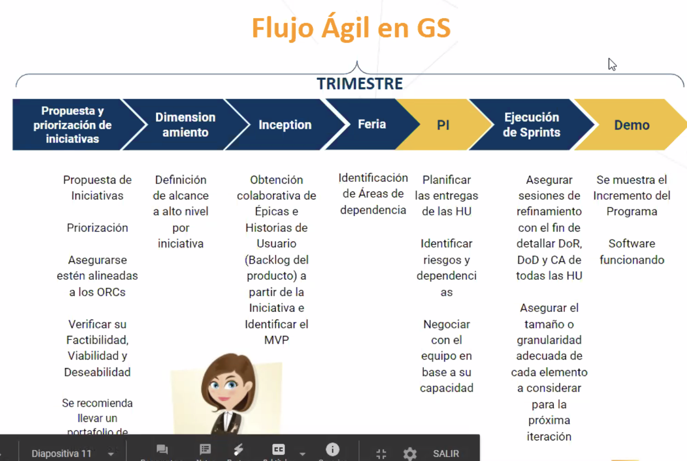{#id .class width=600 height=380px}
</center>

## Antes de PI

En el PI planning no llegamos a nivel de tarea. En el planning de la primera iteración quedan definidas las tareas. 

<center>
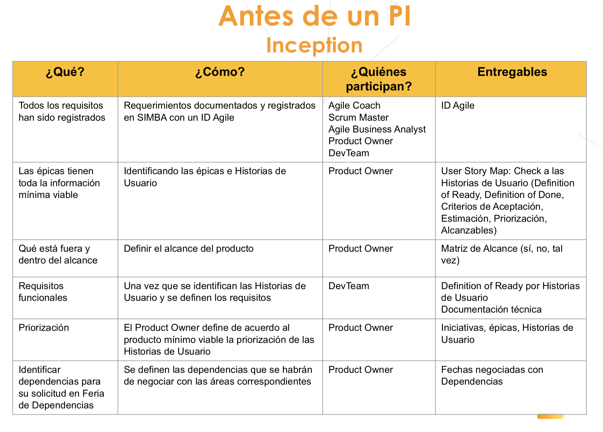{#id .class width=600 height=380px}
</center>


### Descomposición funcional

<center>
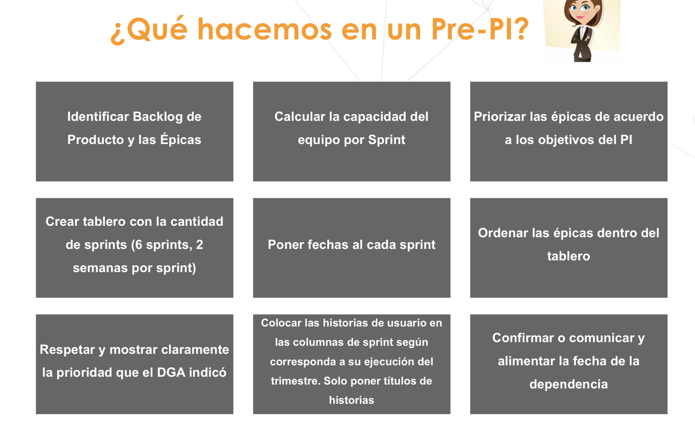{#id .class width=600 height=380px}
</center>


## Durante el PI 
Como resultado se debe tener:

1. Un tablero por equipo que muestra las épicas a desarrollar
2. Compromisos de las áreas de apoyo
3. Productos / Servicios al final del trimestre

### Objetivo de Negocio


### Primer team break Out
- Desarrollo de boards (6 sprints, iteraciones)
  - Las épica deben estar priorizadas
  - Distribuye las historias de usuario a través de todas las iteraciones
  - Identificar que dependencias se tienen con alguna área por sprint

<center>
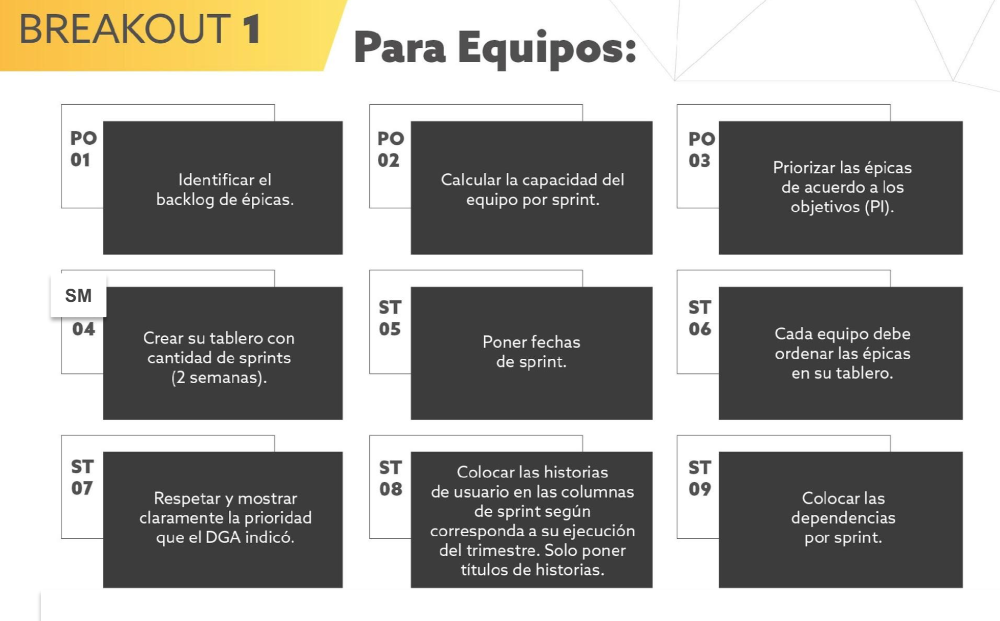{#id .class width=600 height=380px}
</center>

<center>
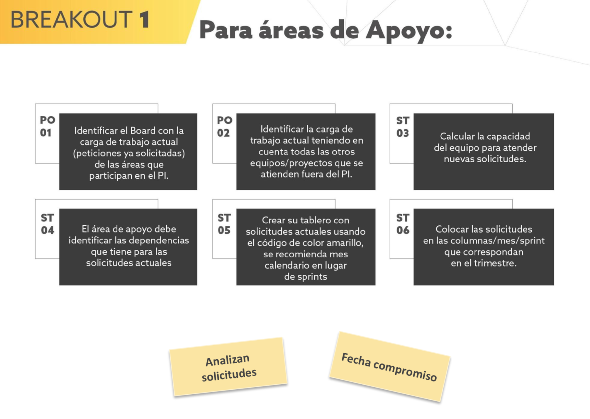{#id .class width=600 height=380px}
</center>

Escriben sus épicas:
- Es una caracteristica del producto enfocada a valor de negocio con un esfuerzo requerido que es menor a tres meses
- Nombre de epica, no folio, prioridad de negocio, puntos de epica 

Historias de usuario:
- Unidad de trabajo con un esfuerzo requerido menor a una iteración. Representacion de una necesidad, en un lenguaje común, colaborativo y conversacional.
- Nombre de la historia de usuario, no folio, prioridad de historia de usuario, puntos de HU

Dependencias:
- Las dependencias se deben escribir por duplicado. Original: board del Team, Duplicado: Diagrama de dependencias


### Segundo team break Out
- Negociacion de dependencias

<center>
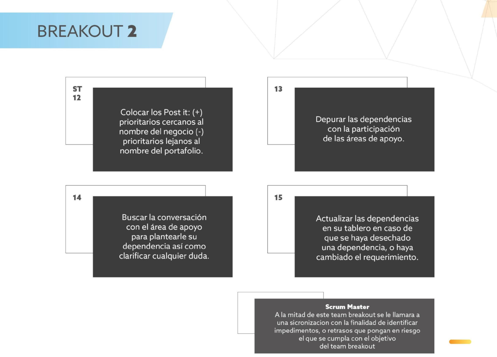{#id .class width=600 height=380px}
</center>


<center>
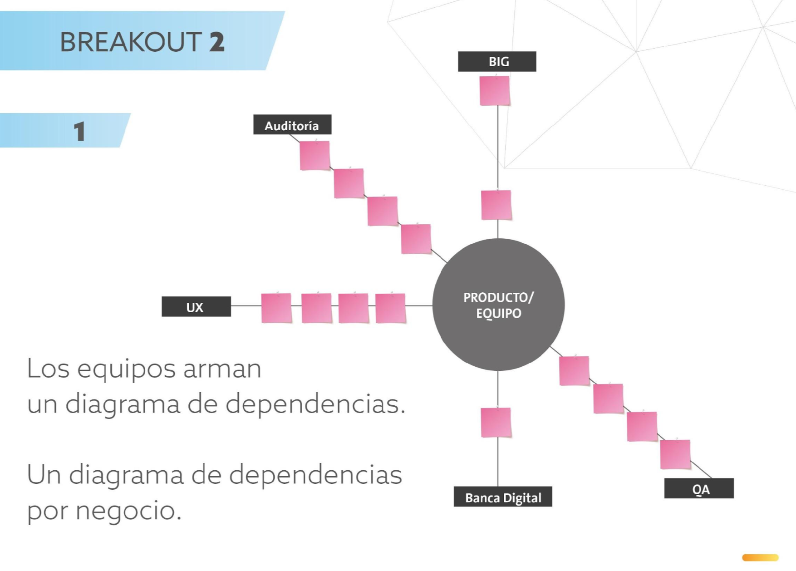{#id .class width=600 height=380px}
</center>

<center>
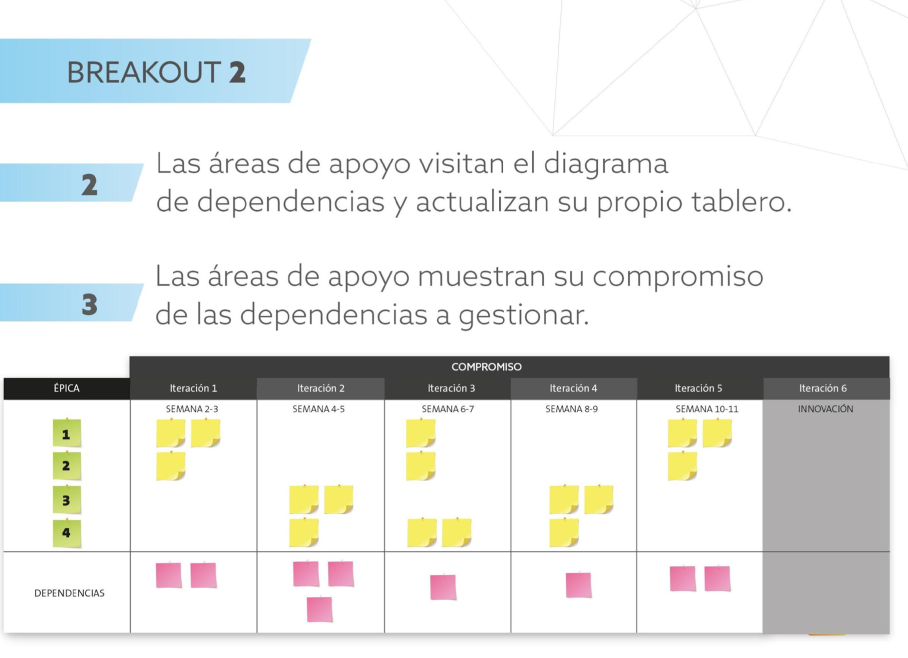{#id .class width=600 height=380px}
</center>


### Tercer team break Out
- Matriz de Riesgos - plan de entregas y métricas


<center>
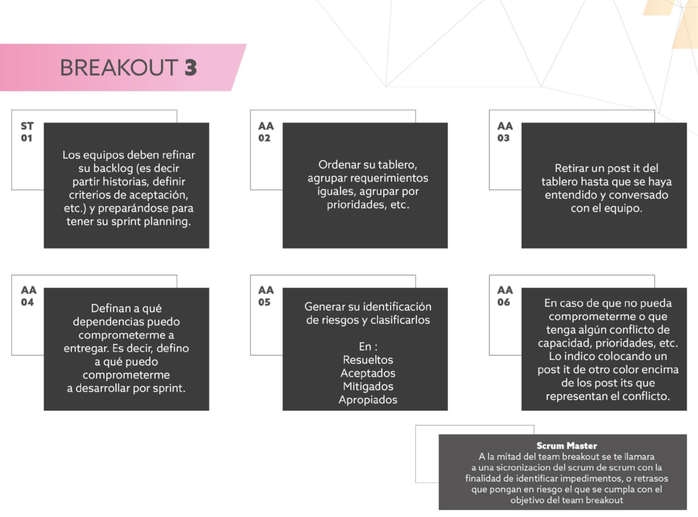{#id .class width=600 height=380px}
</center>

<center>
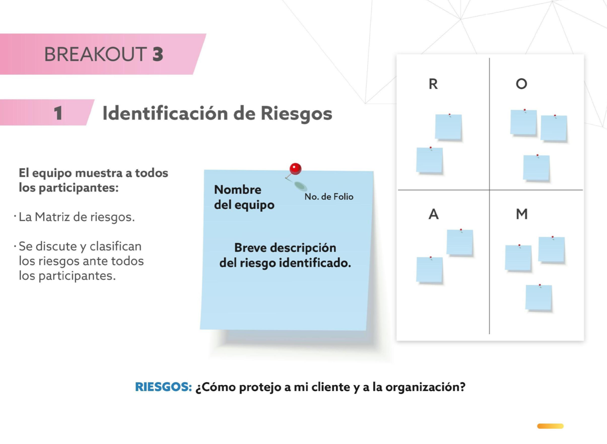{#id .class width=600 height=380px}
</center>


Resultados:
- Un tablero por equipo que muestra las épicas a desarrollar en el PI
- Compromisos de áreas de apoyo
- Productos / servicios al final

Colores:
Amarillo: Historia de usuario
Rosa: Dependencias
Verde: Épica


## Demo Magic

La Demo es un evento donde se comparten los resultados de los esfuerzos de desarrollo y se hacen visibles para los clientes y otras partes interesadas, representa un punto de aprendizaje significativo, convirtiendo cierta incertidumbre en el desarrollo de productos en conocimiento. Los resultados de esta demostración determinan el curso de acción futuro para la inversión en la cartera.

Durante la Demo, los equipos de desarrollo demuestran las nuevas capacidades de las soluciones proporcionando información esencial para las decisiones de inversión a corto plazo en el flujo de valor a nivel de cartera. Como única medida tangible de progreso, mitiga el riesgo de inversión.

